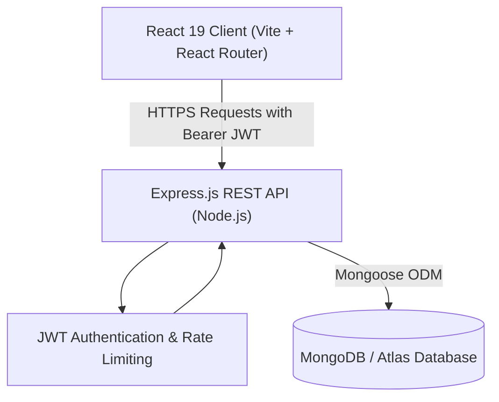

# 🏖️ Sol & Sands — Hospitality Advisory & Project Intelligence Platform

<p align="center">
  
  
  
  
  
  
</p>

<p align="center">
  <b>An end-to-end full-stack MERN platform empowering hotel developers, investors, and consultants with feasibility audits, government subsidy tracking, brand franchise intelligence, and vendor procurement planning.</b>
</p>

---

## 🌟 Live Demo

- **Frontend Application:** [https://sol-sands.onrender.com](https://sol-sands.onrender.com) *(or your deployed Render static site)*
- **Backend API Server:** [https://internship-mern.onrender.com](https://internship-mern.onrender.com)

---

## 📑 Table of Contents

- [Key Highlights & Features](#-key-highlights--features)
- [System Architecture](#-system-architecture)
- [Tech Stack](#-tech-stack)
- [Project Structure](#-project-structure)
- [Getting Started Locally](#-getting-started-locally)
  - [Prerequisites](#prerequisites)
  - [Backend Setup](#1-backend-setup)
  - [Frontend Setup](#2-frontend-setup)
- [API Endpoints Overview](#-api-endpoints-overview)
- [Deployment Guide (Render)](#-deployment-guide-render)
- [License](#-license)

---

## 🚀 Key Highlights & Features

### 📊 1. Project Viability & Capex Modeling
- Financial feasibility blueprints across multiple hotel archetypes:
  - **City / Business Hotel** (High vertical FAR spatial efficiency)
  - **Wildlife & Nature Resort** (Eco-adventure & wellness zoning)
  - **Heritage Palace Restoration** (Experiential luxury & adaptive reuse)
  - **Boutique Wellness Retreat & Highway Waypoints**
- Pre-calculated metrics for **Expected Capex, ADR (Average Daily Rate), Occupancy Forecasts, EBITDA margins, and Payback Schedules**.

### 🏛️ 2. Government Subsidy & Policy Guidance
- Direct compliance pathways for **Capital Investment Subsidies (up to 30%)**, **Stamp Duty Concessions**, and **Electricity Tariff Rebates**.
- Milestone trackers for statutory approvals: Town Planning (TNCP), Fire Department NOC, State Pollution Control Board (CTO/CTE), and Tourism Board Sanctions.

### 🏷️ 3. Brand Affiliation & Franchise Insights
- Strategic insights comparing **Franchise**, **Management Agreement**, and **Revenue Share** models for major hospitality chains (Marriott, IHG, Radisson, Lemon Tree, etc.).
- Critical advisories on Property Improvement Plan (PIP) caps and territorial exclusivity clauses.

### 🛠️ 4. Vendor Procurement Planning Matrix
- Categorized budgeting and procurement guidelines for **Architecture, Civil Infrastructure, MEP/HVAC Systems, Commercial Kitchens & Bars, and FF&E/OS&E Furnishing**.

### 🔐 5. Role-Based Security & Management Console
- **User Dashboard:** Tailored advisory context, personal account management, and inquiry status tracking.
- **Admin Management Console:** Complete moderation portal to manage registered accounts, elevate user permissions, and handle client inquiries.

---

## 🏗️ System Architecture



---

## 💻 Tech Stack

| Domain | Technologies |
| :--- | :--- |
| **Frontend** | React 19, Vite, React Router v7, Lucide Icons, Custom HSL Ocean-Beach Design System |
| **Backend** | Node.js (v24), Express.js, Joi Validation, Helmet Security, Rate Limiter |
| **Database** | MongoDB, Mongoose ODM, Embedded Mongo Engine Fallback |
| **Authentication** | JWT (JSON Web Tokens), BCrypt password hashing |
| **Cloud Hosting** | Render (Static Site for Frontend + Web Service for Backend) |

---

## 📁 Project Structure

```text
Internship-MERN/
├── backend/
│   ├── config/             # Database connection & Environment validation
│   ├── controllers/        # User, Product, and Inquiry business logic
│   ├── middleware/         # Auth (JWT), Rate limiters, Error handling, Joi validation
│   ├── models/             # Mongoose Schemas (User, Product, Inquiry)
│   ├── routes/             # RESTful API route definitions
│   ├── validators/         # Joi input validation schemas
│   ├── server.js           # Express application entrypoint
│   └── package.json        # Backend dependencies & scripts
├── frontend/
│   ├── public/             # Static assets and SPA _redirects rule
│   ├── src/
│   │   ├── components/     # Reusable UI components (Navbar, ProtectedRoutes, etc.)
│   │   ├── context/        # React AuthContext state management
│   │   ├── pages/          # Dashboard, Login, Register, Viability, Brand, Subsidy, etc.
│   │   ├── utils/          # Axios API instance with JWT interceptors
│   │   ├── App.jsx         # App routing structure
│   │   └── main.jsx        # Root application renderer
│   ├── vite.config.js      # Vite build configuration
│   └── package.json        # Frontend dependencies & scripts
├── package.json            # Root workspace scripts
├── .gitignore              # Ignored files (node_modules, .env, builds)
└── README.md               # Project documentation
```

---

## 🛠️ Getting Started Locally

### Prerequisites
- [Node.js](https://nodejs.org/) (v18 or higher recommended)
- [MongoDB](https://www.mongodb.com/) running locally or a MongoDB Atlas URI

### 1. Backend Setup

```bash
# Navigate to the backend directory
cd backend

# Install dependencies
npm install

# Create a .env file in the backend directory
cp -nikhil.env .env  # Or create .env manually with the following values:
```

**`backend/.env` contents:**
```env
NODE_ENV=development
PORT=5001
MONGO_URI=mongodb://localhost:27017/internship_db
JWT_SECRET=your_super_secret_jwt_key_at_least_32_characters_long
JWT_EXPIRES_IN=7d
```

```bash
# Start the backend server
npm run dev
# Server will run at: http://localhost:5001
```

---

### 2. Frontend Setup

```bash
# In a separate terminal, navigate to the frontend directory
cd frontend

# Install dependencies
npm install

# Start the Vite development server
npm run dev
# App will run at: http://127.0.0.1:5173
```

---

## 📡 API Endpoints Overview

### 👤 User & Authentication
| Method | Endpoint | Access | Description |
| :--- | :--- | :--- | :--- |
| `POST` | `/api/users/register` | Public | Register a new account |
| `POST` | `/api/users/login` | Public | Authenticate user & receive JWT token |
| `GET` | `/api/users/profile` | Private | Fetch logged-in user details |
| `GET` | `/api/users` | Admin | List all registered users |
| `PUT` | `/api/users/:id` | Admin | Update user details and roles |
| `DELETE` | `/api/users/:id` | Admin | Remove user account |

### 🏨 Products & Inquiries
| Method | Endpoint | Access | Description |
| :--- | :--- | :--- | :--- |
| `GET` | `/api/products` | Public | Fetch available advisory packages |
| `POST` | `/api/inquiries` | Public/User | Submit project consultation inquiry |
| `GET` | `/api/inquiries` | Admin | Moderate incoming client inquiries |

---

## ☁️ Deployment Guide (Render)

### Backend Web Service
1. Create a **New Web Service** connected to this repository.
2. Set **Root Directory:** `backend`
3. Set **Build Command:** `npm install`
4. Set **Start Command:** `node server.js`
5. Configure Environment Variables: `NODE_ENV`, `MONGO_URI`, `JWT_SECRET`, `JWT_EXPIRES_IN`.

### Frontend Static Site
1. Create a **New Static Site** connected to this repository.
2. Set **Root Directory:** `frontend`
3. Set **Build Command:** `npm install && npm run build`
4. Set **Publish Directory:** `dist`
5. Configure Environment Variable: `VITE_API_URL` = `https://<your-backend>.onrender.com/api`

---

## 📄 License

This project is licensed under the **ISC License**.